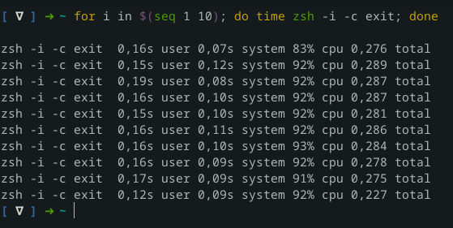

André’s dotfiles
---

```
                          __________________________________________
                          __________________________________________
                                         .                 .      
                                         |                 |      
                            .-.  .--. .-.| .--..-. .-.. .-.| .-.  
                           (   ) |  |(   | |  (.-'(   |(   |(   ) 
                            `-'`-'  `-`-'`-'   `--'`-`| `-'`-`-'`-
                                                   ._.'           
                          __________________________________________
                          __________________________________________
```

## Installation

<p align="center">
	🚧  Working on symlinks with GNU Stow 🚧
</p>

**Warning:** Use this files to suit your own needs. Fork this repository, review it, and adapt it. Do not source anything before checking. Provided 'AS-IS'!

**_Fell free to fork, copy and adpt it to your use_**

## Features

- [ ] [Alacritty](https://alacritty.org/)
- [ ] X with [Awesome WM](https://awesomewm.org/)
- [x] MacOS dotfiles
- [x] Functions && Aliases
- [x] Wget && Curl
- [ ] VIM with traditional vimscript
- [ ] Nvim with lua
- [ ] Bash
- [x] ZSH
- [ ] GNU Stow for symlinks
- [ ] Table of Contents

## ZSH

**Fast umbloated ZSH config achieved by:**
- Loading `compinit` once a day, not every single instance</br>
- Adding only the pluggins that you really use</br>
- No manager to overload your system</br>

**Not ready to ditch your zsh plugin manager ?**
- Try forcing every `compinit load` to check whether the cached `.zcompdump` file needs to be regenerated based on daily intevals, i.e.

```bash
  [[ -n ${ZDOTDIR}/.zcompdump(#qN.mh+24) ]] && compinit || compinit -C
```
**No plugin manager necessary. Just download it and use it.** Heavly inspired by: [ChristianChiarulli/Machfiles](https://github.com/ChristianChiarulli/Machfiles/tree/master/zsh)

#### Give your config. a try by running:

    $ for i in $(seq 1 10); do time zsh -i -c exit; done

<p align="center">
  <a href="./assets/zsh_test_speed.png">
      
  </a>
  </br>
  <a href="https://gist.github.com/ctechols/ca1035271ad134841284">
    Adapted from this commentary.
  </a>
  (This shot was taken from a 2012's  ASUS, i5, with no dedicated graphs \o/)
</p>


## macOS configs

When setting up a new Mac, you may want to uncomment some options and source:

    $ ./.macos

## Feedback

Suggestions/improvements
- [ GitHub Issues](https://github.com/andregda/dotfiles/issues): report a bug or raise a feature request to me.
